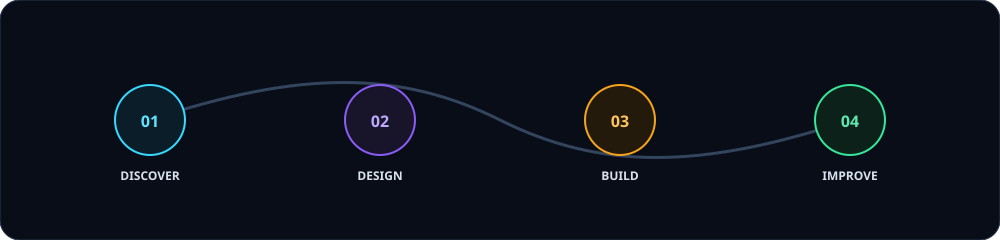

<!-- Header -->

 

<!-- Social Badges -->

## About me

I am a mobile application developer focused on turning complex industrial requirements into reliable, maintainable mobile applications. My primary interests are **ERP systems, Hardware SDK integration (RFID/Printers), and offline-first data architectures.**

- 💼 **Working at Logic Software Ltd.**
- 🛠️ **Expertise in Zebra RFID SDK, Bixolon Thermal Printers & ML-scanning.**
- ⚡ **Optimizing performance using MVVM, Dagger 2, and GreenDAO ORM.**
- 🎓 **Academic background in Economics**, facilitating seamless business logic understanding.
- 📍 **Based in Bangladesh.**

## Engineering approach

 

## 🐍 GitHub Activity Snake

  

---

  <i>“I combine Economic insights with Software Engineering to build solutions that scale.”</i>

