<!-- Hero Banner -->

  
  
  
  

---

## 👨‍💻 Professional Summary

Analytical and results-driven **Mobile Application Developer** with **1.5+ years** of experience in **Native Android (Java)** and **Flutter** development. I specialize in designing and engineering enterprise-grade Industrial ERP, Supply Chain, and HRM systems. My background in **Economics** enables a seamless understanding of complex business logic, corporate workflows, and data-heavy analytics.

- 💼 Currently working at **Logic Software Ltd.** as a **Jr. Apps Developer**.
- 🧩 Architecting scalable Mobile ERP and Smart Production Tracking apps.
- ⚡ Expert in **MVVM Architecture**, **Dependency Injection (Dagger 2)**, and **Clean Architecture**.
- 🛠️ Specialized in hardware integrations (Zebra RFID, Bixolon Thermal Printing) and advanced scanning (Google ML Kit, CameraX).

---

## 💼 Experience

### **Jr. Apps Developer** | Logic Software Ltd.
*Jan 2025 – Present*

- **Industrial ERP & Supply Chain Solutions:** Architect and scale enterprise-level Mobile ERP and Smart Production Tracking apps tailored for the garment and textile industries.
- **Hardware & SDK Integration:** Successfully integrated **Zebra RFID SDK** for real-time fabric roll tracking and **Bixolon SDK** for thermal label printing.
- **Advanced Scanning Modules:** Developed high-speed barcode and QR code scanning modules using **Google ML Kit** and **CameraX API**, eliminating manual logging and cutting factory entry latency.
- **Data Optimization:** Optimized application performance and memory footprint using **MVVM**, **Dagger 2**, and **GreenDAO ORM** for robust offline data persistence.
- **In-App Reporting:** Engineered dynamic PDF invoice and production report generation using the **iTextG library** for direct industrial printing.

---

## 🛠️ What I work with

  

   
   

  
  
  
  
  
  
  

---

## 🏆 Featured Projects

| Project | Tech Stack | Description |
| :--- | :--- | :--- |
| **Platform SmartTrack** | Java, Dagger 2, RFID, Bixolon, Flutter | Lead Developer for enterprise production tracking. Includes **Platform Approvals** for streamlined corporate workflows.  |
| **Platform HRM** | Flutter, REST APIs, FCM | Developed a cross-platform HRM app featuring attendance tracking, hierarchical management, and real-time notifications.   |
| **Insurance Ecosystem** | Spring Boot, Angular 18 | Built a secure insurance management system supporting policy lifecycle, premium tracking, and automated billing. |
| **Daily Finance** | Flutter, SQLite, Encryption | Personal finance tracker featuring expense analytics, local data encryption, and dynamic budgeting.  |

---

## 🧠 Key Competencies

- **Analytical Thinking:** Strong analytical mind with a background in Economics, enabling understanding of complex business logic.
- **Collaboration:** Excellent team collaboration and agile sprint adaptation capability.
- **Learning Agility:** Rapid learning ability for complex enterprise system workflows.

---

## 🎓 Education

- **MSS in Economics** | Dhaka College (Post Graduated 2023)
- **BSS in Economics** | Dhaka College (Graduated 2021)
- **Full Stack Java Development** | IsDB-BISEW IT Scholarship (Professional Diploma)

---

## 📊 GitHub Activity

  
  

### 🐍 Contribution Activity

  

---

  
   
  <i>“Architecting efficiency. Interfacing logic with reality.”</i>

