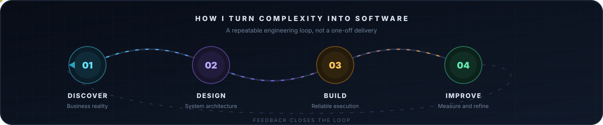

<!-- Hero Banner -->

  
  
  
  

---

## 👨‍💻 Professional Summary

Analytical and result-driven **Enterprise Mobile Application Developer** with **1.5+ years** of professional experience. I specialize in engineering complex, large-scale Industrial ERP, Supply Chain, and HRM systems with specialized proficiency in Hardware Interfacing (Zebra RFID, Bixolon Thermal Printers). My background in **Economics** enables a seamless understanding of complex business logic and data-heavy analytics.

- 💼 Currently working at **Logic Software Ltd.** as a **Jr. Apps Developer**.
- 🧩 Architecting scalable Mobile ERP and Smart Production Tracking apps.
- ⚡ Expert in **Android Native (Java)**, **Flutter (Dart)**, and **Offline-first architectures**.
- 🛠️ Specialized in hardware integrations (RFID, Thermal Printing) and high-speed scanning modules.

---

## ⚙️ Engineering Approach

---

## 🏆 Featured Projects

| Project | Tech Stack | Description |
| :--- | :--- | :--- |
| **Platform SmartTrack** | Java, Dagger 2, RFID, Bixolon | Industrial tracking for textile mills with real-time inventory and automated printing. |
| **Platform HRM** | Flutter, REST APIs, FCM | Cross-platform HRM app with complex organizational logic. [Play Store](https://play.google.com/store/apps/details?id=com.logicsoftbd.hrm) |
| **Insurance Ecosystem** | Spring Boot, Angular 18 | Secure enterprise insurance system with policy lifecycle and automated billing. |
| **Daily Finance** | Flutter, SQLite, Encryption | Financial tracker with monthly budget parsing and category analytics. |

---

## 🛠️ Technical Skill Set

- **Mobile Development:** Native Android (Java), Flutter (Dart)
- **Hardware Integration:** Zebra RFID SDK, Bixolon SDK, Google ML Kit, CameraX API
- **Architecture & DB:** MVVM, Dagger 2, GreenDAO ORM, SQLite, MySQL
- **Web & Backend:** Spring Boot, Java EE, Angular 18, TypeScript

---

## 🎓 Education

- **MSS in Economics** | Dhaka College (Post Graduated 2023)
- **BSS in Economics** | Dhaka College (Graduated 2021)
- **Full Stack Java Development** | IsDB-BISEW IT Scholarship (9-Month Diploma)

---

## 📊 GitHub Activity

  
  

### 🐍 Contribution Activity

  

---

  
   
  <i>“Architecting efficiency. Interfacing logic with reality.”</i>

